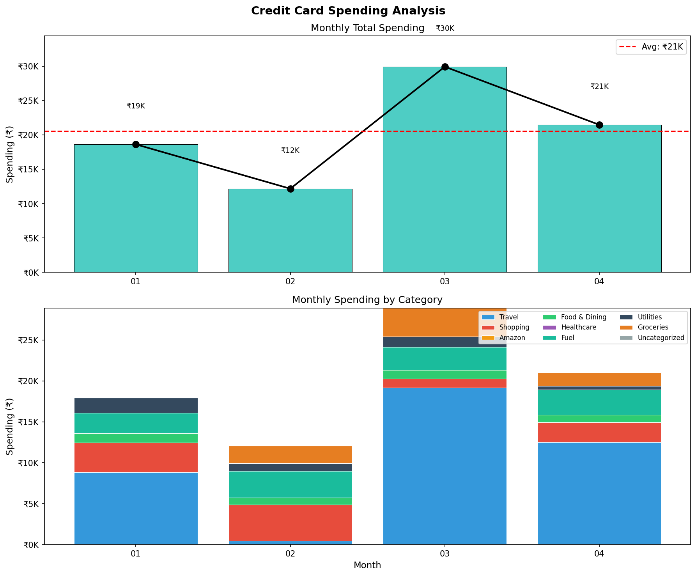

# HDFC CC bill parser

Parse and extract transaction data from HDFC Bank Infinia credit card statements to CSV format.

> **Note:** This tool currently supports only **HDFC Infinia credit card statements from September 2025 onwards**. Earlier statement formats are not supported.

## Features

* Extracts transaction details: date, description, reward points, amount
* Handles both domestic and international transactions
* Supports password-protected PDFs
* Multiple PDFs can be parsed and collated into single CSV
* **Summary mode**: View spending totals without CSV output
* **Category breakdown**: Classify spending by categories using a JSON config file

## Requirements

* Rust (for building from source)
* HDFC Infinia credit card statements (September 2025+ format)

## Installation

```bash
git clone https://github.com/joeirimpan/hdfc-cc-parser-rs.git
cd hdfc-cc-parser-rs
cargo build --release
```

## Usage

### Basic CSV Export

```bash
# Single file
./target/release/hdfc-cc-parser-rs \
  --file statement.pdf \
  --name "YOUR NAME" \
  --password "PDF_PASSWORD"

# Directory of statements
./target/release/hdfc-cc-parser-rs \
  --dir ./statements \
  --name "YOUR NAME" \
  --password "PDF_PASSWORD" \
  --addheaders
```

### Summary Mode

View spending summary without CSV output:

```bash
./target/release/hdfc-cc-parser-rs \
  --dir ./statements \
  --name "YOUR NAME" \
  --password "PDF_PASSWORD" \
  --summary
```

Output:
```
═══════════════════════════════════════════
              SUMMARY
═══════════════════════════════════════════
Total Spent:          ₹      10000.00
Bill Payment:         ₹      15000.00
Points Earned:                    100
Transactions:                      50
```

### Category Breakdown

Add `--categories` with a JSON file to see spending by category:

```bash
./target/release/hdfc-cc-parser-rs \
  --dir ./statements \
  --name "YOUR NAME" \
  --password "PDF_PASSWORD" \
  --summary \
  --categories examples/categories.json
```

Output:
```
═══════════════════════════════════════════
              SUMMARY
═══════════════════════════════════════════
Total Spent:          ₹      10000.00
Bill Payment:         ₹      15000.00
Points Earned:                    100
Transactions:                      50

───────────────────────────────────────────
         CATEGORY BREAKDOWN
───────────────────────────────────────────
Travel                ₹    3000.00  ( 30.0%)
Shopping              ₹    2500.00  ( 25.0%)
Food & Dining         ₹    2000.00  ( 20.0%)
Uncategorized         ₹    2500.00  ( 25.0%)
───────────────────────────────────────────
```

### Categories JSON Format

Create a JSON file mapping category names to merchant patterns:

```json
{
  "Food & Dining": ["SWIGGY", "ZOMATO", "BLINKIT", "DOMINOS"],
  "Travel": ["UBER", "OLA", "IRCTC", "MAKEMYTRIP"],
  "Shopping": ["AMAZON", "FLIPKART", "MYNTRA"],
  "Entertainment": ["NETFLIX", "SPOTIFY", "GOOGLE PLAY"],
  "Utilities": ["JIO", "AIRTEL", "BESCOM"],
  "Finance": ["IGST", "GST", "FINANCE CHARGES"]
}
```

Patterns are matched case-insensitively against transaction descriptions.

## CLI Options

| Option | Description |
|--------|-------------|
| `--file <path>` | Path to a single PDF statement |
| `--dir <path>` | Path to directory containing PDF statements |
| `--name <name>` | Cardholder name as it appears on the statement (required) |
| `--password <pwd>` | PDF password (if encrypted) |
| `--addheaders` | Add CSV header row to output |
| `--sortformat <fmt>` | Date format in filenames for sorting (e.g., `%d-%m-%Y`) |
| `--summary` | Show summary only (no CSV output) |
| `--categories <file>` | JSON file for category breakdown (requires `--summary`) |

## Performance

A similar Python implementation using tabula-py took 70s+ to process 8 PDFs. This Rust implementation processes the same in ~0.02s.

## Spending Analyzer

A Python script for detailed spending analysis with visualizations.

### Features

* Monthly breakdown by category
* Month-over-month trend analysis
* Category trend comparison (first half vs second half)
* Spending volatility metrics
* Visual charts (bar graphs, stacked category charts)
* Support for custom billing cycle start dates (1-31)

### Usage

```bash
# Basic analysis (calendar months)
python analyze_spending.py --csv dump.csv --categories categories.json

# Custom billing cycle (e.g., 16th to 16th)
python analyze_spending.py --csv dump.csv --categories categories.json --cycle-start 16

# Skip graph generation
python analyze_spending.py --csv dump.csv --categories categories.json --no-graph
```

### Options

| Option | Description |
|--------|-------------|
| `--csv <path>` | Path to transaction CSV file (default: dump.csv) |
| `--categories <path>` | Path to categories JSON file (default: custom.json) |
| `--output <path>` | Output path for graph (default: spending_analysis.png) |
| `--cycle-start <day>` | Day of month when billing cycle starts (1-31, default: 1) |
| `--no-graph` | Skip graph generation |

For `--cycle-start` values 29-31, the script automatically adjusts for shorter months (Feb uses 28/29, Apr/Jun/Sep/Nov use 30).

### Sample Output



### Dependencies

```bash
pip install matplotlib
```

## Examples

The `examples/` folder contains sample files:

* `dump.csv` - Sample transaction data
* `categories.json` - Sample category patterns
* `spending_analysis.png` - Sample generated chart

## Analytics with ClickHouse

For advanced analytics on CSV output using `clickhouse-local`:

```bash
# Total points accumulated
cat output.csv | clickhouse-local \
  --structure "tx_date Datetime, tx String, points Int32, amount Float32" \
  --query "SELECT SUM(points) FROM table" \
  --input-format CSV

# Total debits
cat output.csv | clickhouse-local \
  --structure "tx_date Datetime, tx String, points Int32, amount Float32" \
  --query "SELECT SUM(amount) FROM table WHERE amount < 0" \
  --input-format CSV
```

## License

MIT
